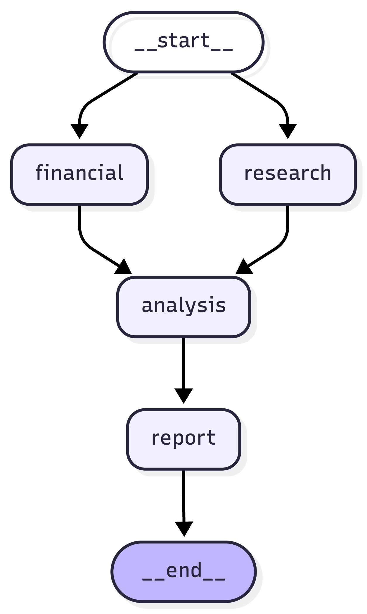
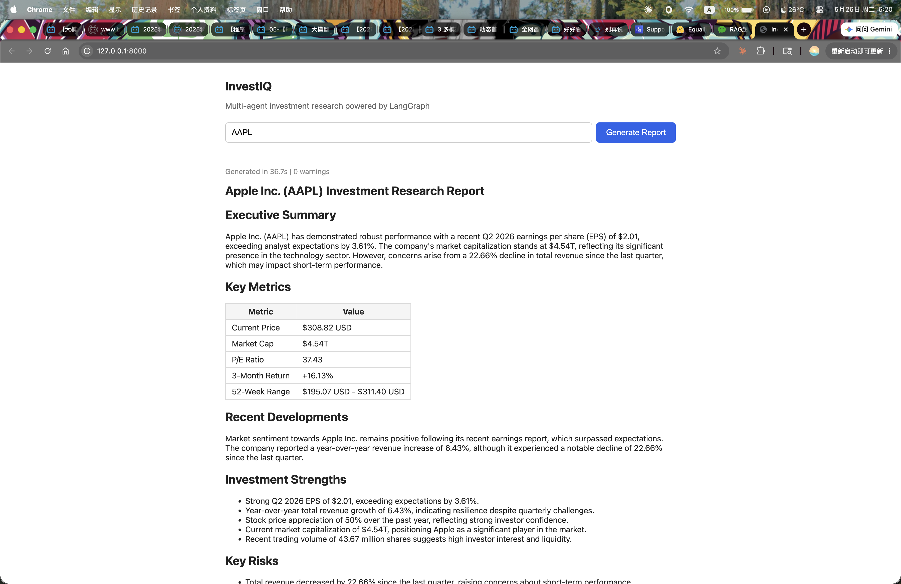

# InvestIQ

> Multi-agent investment research system: ticker in, structured Markdown report out.

InvestIQ uses [LangGraph](https://github.com/langchain-ai/langgraph) to orchestrate four specialized agents — Research, Financial, Analysis, and Report — that together turn a single stock ticker into a fully-structured Markdown investment research report in 20–30 seconds.



## What it does

```
Input:  "AAPL"

Output: 7-section Markdown report
        ├── Executive Summary
        ├── Key Metrics            (live yfinance data)
        ├── Recent Developments    (Tavily-sourced news)
        ├── Investment Strengths   (data-cited)
        ├── Key Risks              (data-cited)
        ├── Synthesis              (2-paragraph narrative)
        └── Disclaimer             (compliance-aware)
```

## Demo



## Architecture

| Agent     | Tool/Model                | LLM? | Responsibility                                |
| --------- | ------------------------- | ---- | --------------------------------------------- |
| Research  | Tavily + GPT-4o-mini      | ✅   | Search and summarize recent news              |
| Financial | yfinance                  | ❌   | Fetch price, fundamentals, volatility         |
| Analysis  | GPT-4o-mini + Pydantic    | ✅   | Synthesize strengths, risks, narrative        |
| Report    | GPT-4o-mini               | ✅   | Generate final Markdown report                |

Key design decisions:

- **Financial Agent intentionally does not use an LLM.** yfinance returns structured numeric data — passing those numbers through an LLM only adds latency, cost, and hallucination risk. The agent emits clean dicts that downstream LLM agents consume as ground truth.
- **Parallel fan-out, then fan-in.** Research and Financial run concurrently from `START`; Analysis waits for both to complete (LangGraph's implicit barrier on multiple inbound edges) before running. This roughly halves end-to-end latency vs. a sequential pipeline.
- **Soft failure mode.** Each agent catches its own exceptions and appends to a shared `errors` channel (with an `add` reducer) instead of raising. One agent's failure never kills the pipeline; downstream agents see the missing data and degrade gracefully. The Analysis agent emits an explicit `data_completeness` note that the Report agent surfaces in the Disclaimer.
- **Compliance-aware design.** The Disclaimer requires a verbatim "Data completeness: …" sentence (grep-able for automated audits), and the long-form narrative section is named "Synthesis" rather than "Outlook" to avoid implying forward-looking statements under SEC framing.

## Tech stack

- **LangGraph 1.2** — workflow orchestration with typed shared state
- **OpenAI GPT-4o-mini** (via LangChain) — Research / Analysis / Report LLM calls
- **Tavily API** — recent news search
- **yfinance** — live price, fundamentals, and historical price series
- **FastAPI + uvicorn** — HTTP API and ASGI server
- **Single-file HTML + marked.js** (CDN) — minimal browser UI, no build step
- **Docker + docker-compose** — one-command local deployment

## Quick start

### Prerequisites

- Python 3.11+
- An OpenAI API key
- A Tavily API key (free tier: 1,000 searches/month)

### Local setup

```bash
git clone https://github.com/MoreClosersy/InvestIQ.git
cd InvestIQ

python3.11 -m venv .venv
source .venv/bin/activate

pip install -r requirements.txt

cp .env.example .env
# Edit .env and fill in OPENAI_API_KEY and TAVILY_API_KEY.

uvicorn api.main:app --reload
```

Then open http://127.0.0.1:8000 in your browser.

### Docker setup

```bash
cp .env.example .env
# Edit .env and fill in OPENAI_API_KEY and TAVILY_API_KEY.

docker compose up --build
```

Then open http://localhost:8000 in your browser.

## Project structure

```
InvestIQ/
├── agents/              # LangGraph nodes, one per agent role
│   ├── research_agent.py    # Tavily search + LLM news summarization
│   ├── financial_agent.py   # yfinance data fetch (no LLM)
│   ├── analysis_agent.py    # Structured Pydantic output (strengths/risks/...)
│   └── report_agent.py      # Final Markdown report generation
├── tools/               # External integrations
│   ├── search_tool.py       # Tavily wrapper
│   └── finance_tool.py      # yfinance wrapper
├── graph/               # Shared state and workflow assembly
│   ├── state.py             # AgentState TypedDict + reducers
│   └── workflow.py          # StateGraph wiring + compile
├── api/                 # FastAPI app
│   └── main.py              # /research endpoint + minimal HTML UI
├── tests/               # Smoke tests + manual integration runners
├── docs/                # Workflow diagram + sample report
├── Dockerfile           # Production image (python:3.11-slim)
├── docker-compose.yml   # One-command local deployment
├── .dockerignore        # Keeps .venv / tests / .git out of the image
├── requirements.txt     # Pinned dependencies
└── .env.example         # Template for API key configuration
```

## Sample output

See [docs/sample-report.md](docs/sample-report.md) for a full Apple Inc. report generated by InvestIQ.

## What I'd do next

- **RetryPolicy on Research and Financial nodes** — Tavily and yfinance both have occasional transient failures; LangGraph's `RetryPolicy` on `add_node` would absorb these without changing the graph shape.
- **Caching layer** — same ticker re-requested within 5 minutes currently re-runs the full ~$0.01 pipeline. An in-memory TTL cache (or Redis for multi-instance deployment) keyed on ticker would cut both cost and latency dramatically.
- **Multi-ticker batch analysis** — LangGraph's `Send` API supports dynamic fan-out; a single request like `["AAPL", "MSFT", "GOOGL"]` could run N parallel workflows and return a combined comparison report.
- **Sector baseline injection** — currently the Analysis agent has no comparative anchor (it can't say "P/E of 37 is high *for this sector*"). Pulling sector-average fundamentals into the prompt would unlock relative valuation reasoning.
- **Cross-source fact verification** — numbers that appear in news snippets (revenue, growth %, earnings) should be cross-checked against yfinance fundamentals before being cited as strengths/risks, to catch reporter errors and stale figures.

## License

MIT
